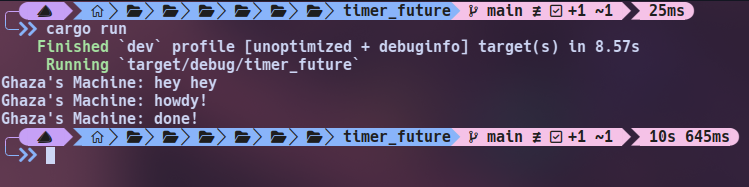

# Advanced Programming Module 9 - Timer Future
### Muhammad Ghaza Fadhlilbaqi - 2306173321

## Understanding how it works

The newly added message that was placed under the spawner is **printed first**, before the print statements inside the spawner above it. This happens because the first two prints are placed in an ```async``` function that is called by the spawner. The spawner is a process that is running in the background and does not halt the main process, so the main function can just proceed to the next instruction, which in this case, is printing the newly added message.